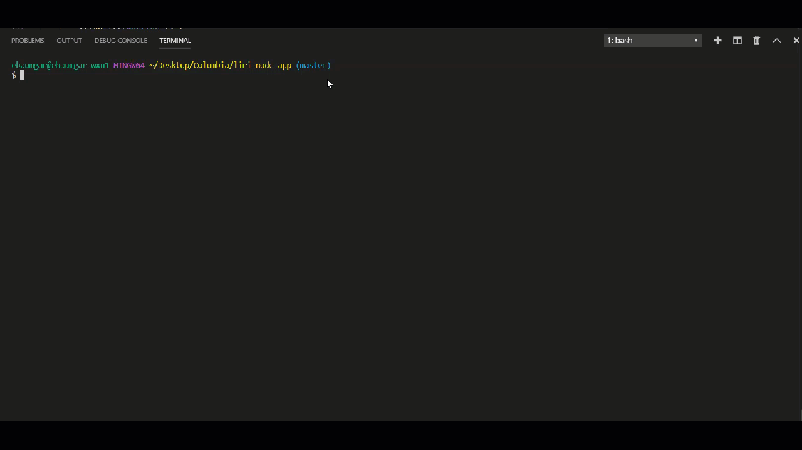
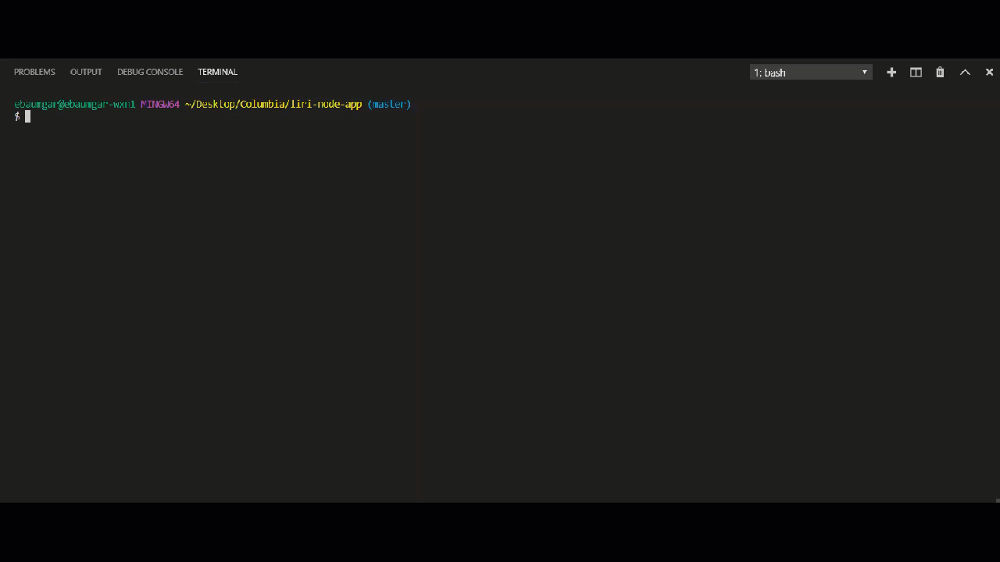
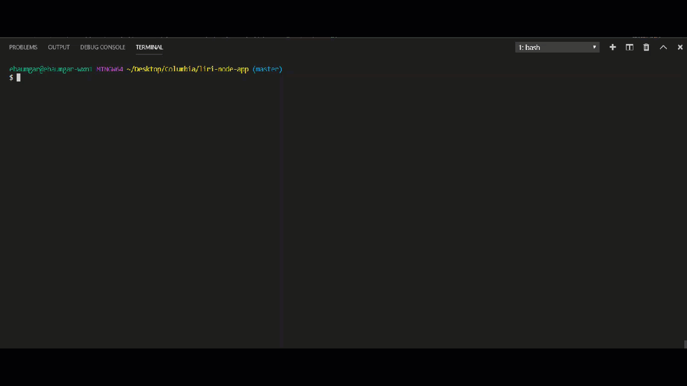
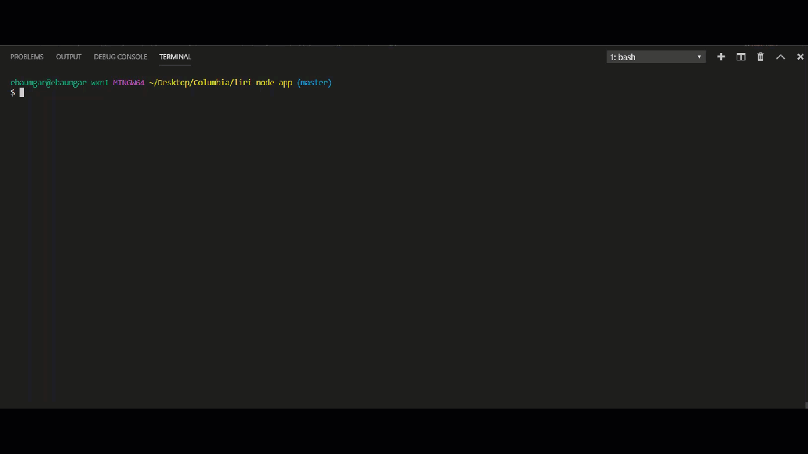

# liri-node-app
LIRI is a Language Interpretation and Recognition Interface. LIRI is a command line node app that takes in parameters (Spotify for songs, Bands in Town for concerts, and OMDB for movies) and gives you back data.

_When using Liri, you will need to first innstall these packages from npm:_
* Node-Spotify-API 
* Axios
* Moment

_You will also need to create your own API keys for the following:_
* Spotify API
* OMDB API
* Bands In Town API

_Once the above is complete, you can follow these instructions to make it work..._
# Steps to use
**(assuming you clone to you machine)**
1. In the command line write: node liri.js
1. Decide if you want to search for a song, concert, or movire
1. Use the following corresponding command in the command line
    * spotify-this-song
    * movie-this
    * concert-this
    * do-what-it-says
1. After the command, input the detail you are searching for (no need for quotes)
1. All responses from commands performed will be stored in the corresponding log file

## Example search in the command line
**node liri movie-this elf**

**node liri spotify-this-song testify**

**node liri concert-this jonas brothers**

**node liri do-what-it-says**

# What happens with _spotify-this-song_
The node-spotify-api npm package will be triggered and will call the Spotify API. Then, this will show the following information about the song in your terminal/bash window and store the response into a corresponding log file:
* Artist(s)
* The song's name
* A preview link of the song from Spotify
* The album that the song is from
_If no song is provided then your program will default to "The Sign" by Ace of Base._

# What happens with _movie-this_
The OMDB API will be triggered and calls this API. Then, this will output the following information to your terminal/bash window and store the response into a corresponding log file:
* Title of the movie.
* Year the movie came out.
* IMDB Rating of the movie.
* Rotten Tomatoes Rating of the movie.
* Country where the movie was produced.
* Language of the movie.
* Plot of the movie.
* Actors in the movie.
_If the user doesn't type a movie in, the program will output data for the movie 'Mr. Nobody.'_

# What happens with _concert-this_
The Bands in Town Artist Events API will be triggered for an artist and render the following information about each event to the terminal and store the response into a corresponding log file:
* Name of the venue
* Venue location
* Date of the Event

# What happens with _do-what-it-says_
This is an example of a the app reading existing informaiton that is programmed into a file. Run this command to see what the output will be

# The technologies used in this app:
* node.js
* Axios
* Spotify API
* Bands in Town API
* OMDB API

